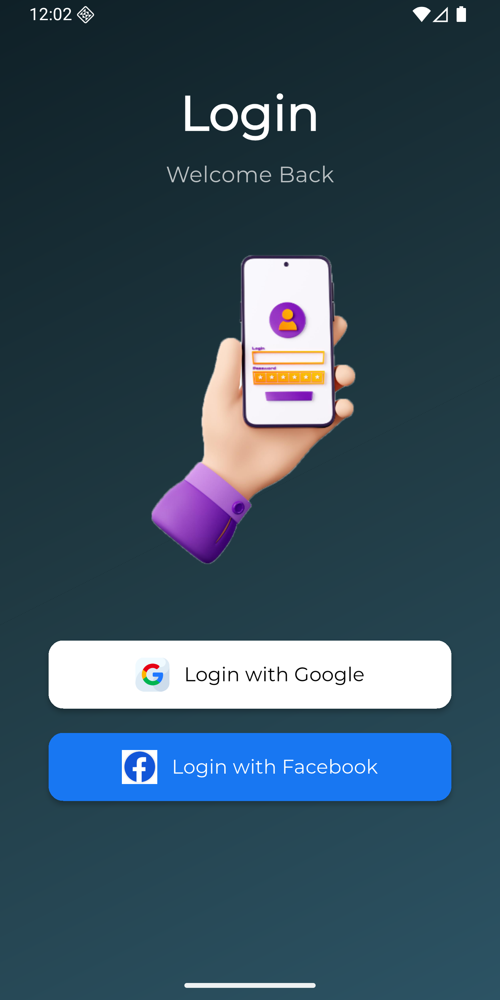
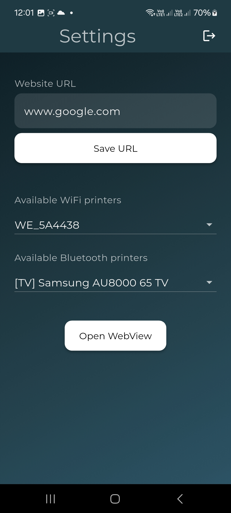
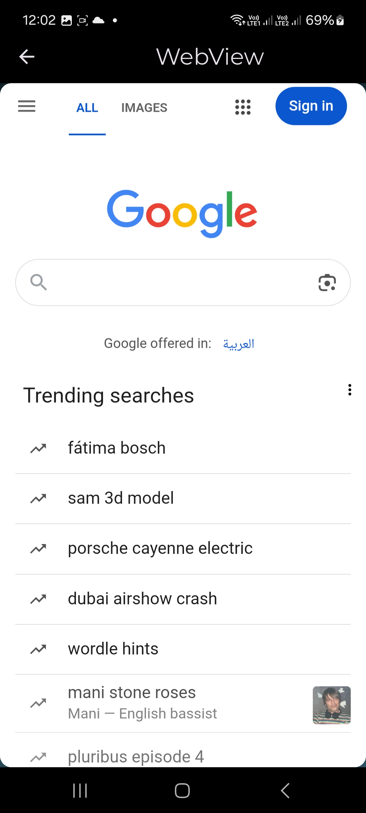

# Easacc Flutter Task

A Flutter app that allows users to log in with Google or Facebook, configure settings including WiFi & Bluetooth devices and website URL, and open a WebView. Built with Clean Architecture, powered by Cubit for seamless state management and a smooth user experience.

---

## ✨ Features
- Login with Google and Facebook.
- Persistent login: users are directed to Settings screen if already signed in.
- Settings screen:
  - Configure Website URL.
  - Select available WiFi and Bluetooth devices.
- Open external WebView from the app.
- Clean and maintainable architecture.
- Smooth and responsive user experience.

---

## 🛠️ Tech Stack
- **State Management:** Cubit
- **Navigation:** GoRouter
- **Architecture:** MVVM / Clean Architecture
- **Networking & Authentication:** Firebase Auth, Google Sign-In, Facebook Login
- **WiFi:** wifi_iot for scanning and connecting to WiFi networks
- **Bluetooth:** FlutterBluePlus for scanning Bluetooth devices

---

## 🎥 Demo GIF

  

---

## 📸 Screenshots

 

---

